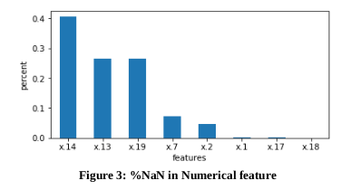
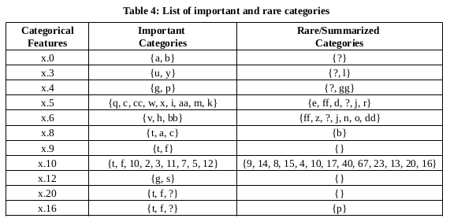

## GOAL

The aim is to train a model which can classify good and bad customers.

## ASSUMPTIONS & DESIGN CHOICE

“Unnamed:0” column is an ID with high cardinality, so drop this column.

Categorical feature: If the unique counts in feature<=25.

Numerical feature: If the unique counts in feature>25.

“?” is NaN only in case of Numerical feature.

In case of Categorical feature “?” is considered as a category.

“,” is converted to Decimals.

RARE Categories: If percent count of (‘?’, ‘t’, ‘a’, ‘bb’, etc.) are less than 5%.

Categories RARE in one feature are not RARE in other.

If %NaN is greater than 50% in a particular column, so drop it.

Default threshold of 0.5 is used for binary prediction (hence giving equal importance to both classes) which can be changed according to busniess problem.

## TRAINING-DATA ANALYSIS

Counts (good) = 2398

Counts (bad) = 273

No. of records in the training set = 2671

No. of records in the validation set = 490

Total no. of independent features = 21

No. of Numeric features identified after feature engg.= 5

No. of Categoric features identified after feature engg.= 12

## THE APPROACH

Transform (feature engg./feature selection) both training and val/test data.

Train the classifier.

Save model as model.h5 file.

Load model.h5 and do the final prediction on val/test data.

## DATA VISUALIZATION

Figure 1 shows the class wise distribution of the target variable. The distribution is skewed. Figure 2 shows the counts of unique values in each features. The red horizontal line is the threshold at count=25. The features having counts > 25 are Numerical and counts <= 25 are categorical.

Figure 3 shows the %NaNs in each numeric feature column. NaNs for numeric features will be replaced by group mean of the respective target class. Figure 4 shows the count of each categories in x.6 feature. The red horizontal line is the 5% threshold. Rare categories by assumption are those categories whose %counts are < 5% of the total records. In case of x.6 feature, rare categories are {ff, z, ?, j, n, o, dd}. Summarize these categories into one category ‘rare’ as shown in Figure 5. Categories {v, h, bb} are important categories.

Figure 6 and Figure 7 shows the Groupby means wrt Target Class of features x.7 and x.14 numeric feature. From the plots it is evident that it is better to replace NaNs in feature columns by Group Means instead of Column Mean.

One of the key findings of this work was multicollinearity in the numeric Dataframe. I found that some features are almost similar x.1 ≈ x.17, x.2 ≈ x.18 and x.139≈ x.19. Table 1 shows the correlation coefficients from the correlation matrix. So, I dropped these 3 features (x.17, x.18 and x.19) from our training dataset.

Table 2 and Table 3 shows the dropped and selected features after feature engineering and data visualization.

Table 4 lists the important and rare categories of each categorical feature after applying the summarization (5% threshold). The Rare Categories column in the above Table will be categorised as ‘rare’ category for each categorical features.

## MODELS USED

• XGBoost: Boosting is an ensemble method. It uses multiple models chained together. Every trees within boosting scheme is going to boost attributes that led to misclassification from previous trees. It basically built multiple trees on top of each other to correct the errors of the previous tree before it. It uses L1 and
L2 regularisation to prevent overfitting. Unlike Decision trees where it stops branching once it stops seeing the benefit of it, XGBoost takes a different approach by actually going very deep by default then tries to prune that tree backwards. This results in deeper trees but highly optimised.

• Random Forest: It is a bagging algorithm which randomly selects subsets of features and build many decision trees. Since the each DT are not trained on all the features (or informations) and records random forest helps avoids overfitting. The majority votes is the decision taken by Random Forest after getting
the decision of each DTs.

• Logistic Regression: It is similar to linear regression which predicts True or False instead of predicting something continuous. It uses logit function.

• Neural Network: Neural networks are used to model complex patterns in datasets using multiple hidden layers and non-linear activation functions like (ReLU, sigmoid, tanh, etc). A neural network has 3 components: Input layer (no of features), hidden layers (no of computation layers) and the output layer. It
is usually trained iteratively using optimization techniques like gradient descent. After each cycle of training, an error metric is calculated based on the difference between prediction and target. The derivatives of this error metric are calculated and propagated back through the network using a technique
called backpropagation. Each neuron’s coefficients or weights are then adjusted relative to how much they contributed to the total error. This process is repeated iteratively until the network error drops below an acceptable threshold.

## RESULTS

4 popular models were used for completing the binary task. From Table 5 and Figure 8 it is evident that Neural Network has outperformed the other Machine Learning models. 0.80 and 0.87 were the maximum Avg. Fscore and AUC score obtained respectively. The parameters used in the Neural Network are shown in Table 6. Figure 9
shows the training and val loss of the model.

## CONCLUSION

Models like Random Forest and XGBoost cannot extrapolate. This means that they can only make a good prediction for situations already encountered in the training history. Hence both models overfitted. Linear Models like logistic regression have very few parameters compared to Random Forests. It means that Random Forests will overfit more easily than a Logistic Regression. Neural networks allowed to discover features and add nonlinearity unlike Logistic Regression. It can
learn complexity in the dataset easily by updating its weights hence outperforming other ML Models.

## THREATS TO VALIDITY

New/unseen categories in the test_data say (‘abc’, ‘xyz’, etc.) may affect the performance of the model. 

Training the Neural Network with epoch > 150 will overfit the model. 

Any voilation of Assumption will affect the performance of the model. 

Full hyperparameter tuning of XGBoost were not done. Categorical features independence tests using Chi square were not done.

## EXPERIMENTS WHICH DIDN’T WORKED

Reducing the dimensions using PCA.

Standardizing/Normalizing numeric features using standard scaling/log transform.

Removing Outlier i.e., records which are above 99 percentile and below 1 percentile in the quantile range.

## EXPERIMENTS WORTH TRYING

Since feature x.1 has a comma between numbers. One can split it into 2 Numeric features.

Feature x.10 is a mix of numeric and categoric variables. This feature can be splitted into 2 separate ones.

